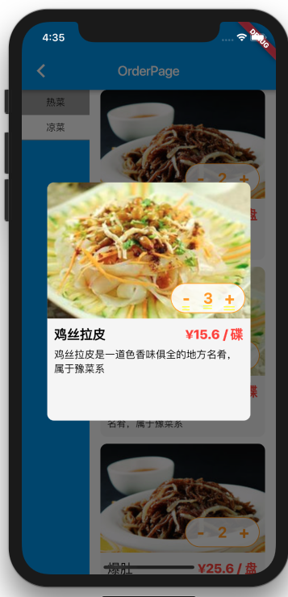

# flutter_dish_order

a dish order app using flutter

| Home | Detail |
| --- | ------- |
|  |  |

## Getting Started

For help getting started with Flutter, view our online
[documentation](https://flutter.io/).

## Building

You can follow these instructions to build the gallery app
and install it onto your device.

### Prerequisites

If you are new to Flutter, please first follow
the [Flutter Setup](https://flutter.io/setup/) guide.

### Building and installing the Flutter app

* `cd $APP_ROOT`
* `flutter upgrade`
* `flutter run --release`

The `flutter run --release` command both builds and installs the Flutter app.
